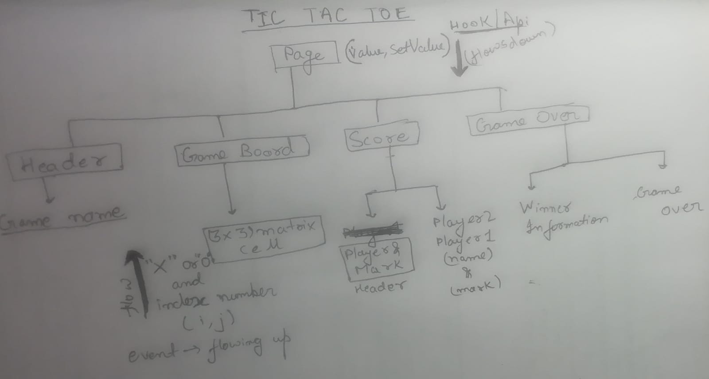

Local state is most often managed in React using the useState hook. For example, local state would be needed to show or hide a modal component or to track values for a form component, such as form submission, when the form is disabled and the values of a form's inputs.
